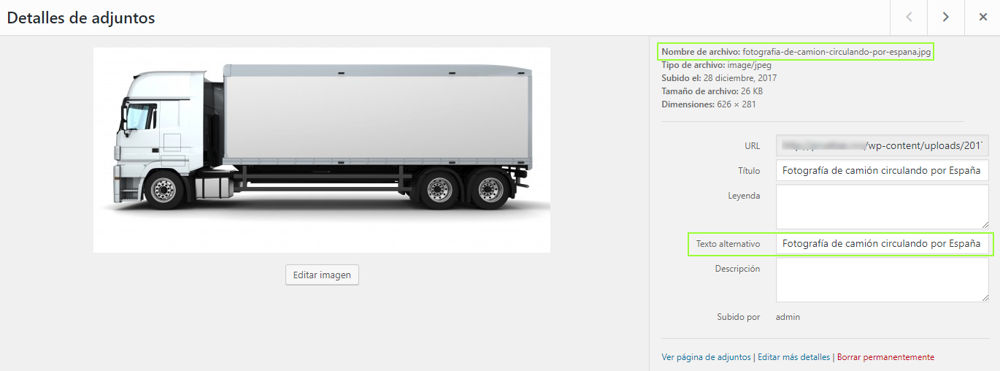

# CL Upload Media Rename
WordPress plugin for rename image names on upload to a safe name and then use previous file name as ALT text.

This plugin make possible that you upload a image to your WordPress media with a name like `Fotografía de camión circulando por España.jpg` and when file is uploaded will be renamed to `fotografia-de-camion-circulando-por-espana.jpg` in your hosting and WOrdPress database and set ALT name to **Fotografía de camión circulando por España**.

